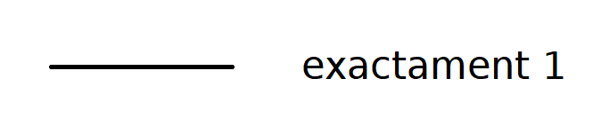

# Activitat 8: **Classes pròpies**


## **Objectiu**

Per la realització d'aquesta activitat cal que feu una **proposta pròpia** per poder treballar durant les següents activitats. Caldrà que realitzeu el diagrama **```UML```** de les vostres **Classes**, així com crear les **Classes** necessàries per poder provar la vostra proposta.

## **Procediment**

Per dur a terme aquesta activitat, heu de crear un **repositori** de **```git```** amb les següents característiques:

**1.** amb el nom: **```<CognomAlumne>-A08-classes-propies```** (important respectar tant els guions com les majúscules o minúscules del nom del repositori.), us recordo que a on diu **```<CognomAlumne>```** vol dir que cal escriure el cognom de l'alumne, **sense el nom de l'alumne**.

**2.** que sigui **privat** i per últim,

**3.** caldrà que convideu a l'usuari **```joanpardogine```**.

<br>
<hr>
<br>

## **Índex**

[**A081** - Activitat 8: **Classes pròpies** (**1a part**)](./README.md#a081---activitat-8-classes-pròpies-1a-part)

[**A082** - Activitat 8: **Classes pròpies** (**2a part**)](./README.md#a082---activitat-8-classes-pròpies-2a-part)

[**A083** - Activitat 8: **Classes pròpies** (**3a part**)](./README.md#a083---activitat-8-classes-pròpies-3a-part)

<br>
<hr>
<br>

# A081 - Activitat 8: **Classes pròpies** (**1a part**)


La vostra proposta inclourà de **manera obligatòria** la ***Classe* ```Persona```**:


És a dir, que la vostra proposta ha de contenir la definició i el desenvolupament de dues ***Classes filles*** de la  ***Classe* ```Persona```**.


**Per exemple**: Tal i com us vaig mostrar en el cas de l'**```Hospital```**.


<br>
<hr>
<br>

# A082 - Activitat 8: **Classes pròpies** (**2a part**) 

En aquesta segona part, cal que creeu una ***nova*** **Classe** la qual tindrà, a part dels atributs que vosaltres vulgueu que tingui, **obligatoriament**, dos atributs que serà un vector de cadascuna de les **classes filles** que heu creat.

Seguint amb l'exemple de l'**```Hospital```**, aquesta seria la definició de la **Classe** **```Hospital```** en aquest cas.


Com podeu observar la **Classe** **```Hospital```** de l'exemple té els següents **atributs**:

### **1.** - **```nom```** de tipus ```String```, 
### **2.** - **```qtatMaxLlits```** de tipus ```Int```, 
### **3.** - **```llistaMetges```** de tipus ```vector``` d'elements de tipus **```Metge```**, 
### **4.** - **```llistaPacients```** de tipus ```vector```  d'elements de tipus **```Pacient```**.

<hr>

> ## Cardinalitat a **UML**
> La cardinalitat s'expressa en termes de:
> ## **```exactament un```**
> 
>
> ## **```diversos```**
> 
> 
> ## **```opcional```**
> 
> 

> ## **```un o més```**
> 
> 
> 
> ## **```zero o més```**
> 
<hr>


# A083 - Activitat 8: **Classes pròpies** (**3a part**) 

En aquesta **tercera part**, cal que definiu la relació que té la ***nova*** **Classe** que heu creat a la [**A082** - Activitat 8: **Classes pròpies** (**2a part**)](./README.md#a082---activitat-8-classes-pròpies-2a-part) 

Una vegada més, continuant amb l'exemple de l'**```Hospital```**, aquesta seria la definició final del que us demano.

